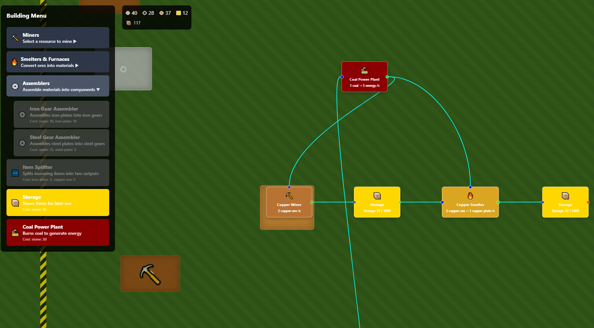

# Atata

A factory automation game built with React, TypeScript, and ReactFlow. Build and manage complex production chains, mine resources, process materials, and optimize your industrial empire.



## 🎮 Game Features

### Resource Management
- **Mining Operations**: Extract iron ore, coal, copper ore, and stone from resource nodes
- **Processing Chains**: Transform raw materials into refined products through smelters and assemblers
- **Storage Systems**: Store resources in dedicated storage buildings with configurable capacity
- **Inventory Management**: Track resources across all buildings and storage facilities

### Building Types
- **Miners**: Extract resources from resource fields (Copper, Coal, Iron, Stone)
- **Smelters**: Process ores into plates (Iron Smelter, Copper Smelter, Steel Furnace)
- **Assemblers**: Create components from processed materials (Iron Gear, Steel Gear)
- **Utilities**: Item splitters for distribution and routing
- **Power Plants**: Coal-powered energy generation
- **Storage**: Dedicated resource storage facilities

### Gameplay Mechanics
- **Node-Based Construction**: Place and connect buildings using an intuitive drag-and-drop interface
- **Real-Time Simulation**: Automated production cycles with 1-second tick intervals
- **Resource Flow**: Connect buildings to create automated production chains
- **Power Management**: Buildings consume energy for operation
- **Terrain System**: Procedurally generated resource fields with varying richness

## 🚀 Getting Started

### Prerequisites
- Node.js (v16 or higher)
- npm or yarn

### Installation

1. Clone the repository:
```bash
git clone https://github.com/p-tkachuk/atata.git
cd atata
```

2. Install dependencies:
```bash
npm install
```

3. Start the development server:
```bash
npm run dev
```

4. Open your browser and navigate to `http://localhost:5173`

### Build for Production

```bash
npm run build
npm run preview
```

## 🎯 How to Play

1. **Start Mining**: Click on resource nodes to manually extract materials and build your initial stockpile
2. **Place Buildings**: Select a building type from the menu and click on the terrain to place it
3. **Connect Production**: Drag connections between buildings to create automated production chains
4. **Manage Resources**: Monitor your inventory and storage capacity in the resource panel
5. **Expand**: Build more complex production chains and optimize your factory layout

### Building Costs
- **Miners**: 5 stone each
- **Smelters**: 10 stone + 5 ore
- **Assemblers**: 10 stone + 10 iron plates
- **Storage**: 10 stone each
- **Power Plant**: 20 stone

## 🏗️ Architecture

### Tech Stack
- **Frontend**: React 19 with TypeScript
- **UI Framework**: ReactFlow for node-based interface
- **Build Tool**: Vite
- **Styling**: CSS Modules
- **State Management**: React hooks with custom state management

### Project Structure
```
src/
├── components/          # React components
│   ├── BuildingMenu.tsx # Building selection interface
│   ├── BuildingNode.tsx # Individual building representation
│   ├── ResourcePanel.tsx# Resource inventory display
│   └── ...
├── services/           # Business logic services
│   ├── BuildingPlacementService.ts
│   ├── ResourceInventoryService.ts
│   └── ...
├── simulation/         # Game simulation engine
│   ├── TickProcessor.ts
│   └── buildings/      # Building behavior implementations
├── hooks/             # Custom React hooks
├── types/             # TypeScript type definitions
├── config/            # Game configuration
└── utils/             # Utility functions
```

### Key Concepts
- **Tick-Based Simulation**: Game state updates every second
- **Node Validation**: Ensures buildings are placed on valid terrain
- **Resource Flow**: Materials move through connected production chains
- **Dependency Injection**: Services are injected into components for testability

## 🛠️ Development

### Available Scripts
- `npm run dev` - Start development server
- `npm run build` - Build for production
- `npm run lint` - Run ESLint
- `npm run preview` - Preview production build

### Code Quality
- TypeScript for type safety
- ESLint for code linting
- Modular architecture with separation of concerns
- Comprehensive error handling

## 🤝 Contributing

1. Fork the repository
2. Create a feature branch (`git checkout -b feature/amazing-feature`)
3. Commit your changes (`git commit -m 'Add amazing feature'`)
4. Push to the branch (`git push origin feature/amazing-feature`)
5. Open a Pull Request

## 📄 License

This project is licensed under the MIT License - see the [LICENSE](LICENSE) file for details.

## 🙏 Acknowledgments

- Inspired by factory automation games like Factorio
- Built with [ReactFlow](https://reactflow.dev/) for the node-based interface
- Uses [Vite](https://vitejs.dev/) for fast development and building

## 🤖 Development Note

This game was fully coded using vibe coding with various AI agents, including assistance from Cline, a highly skilled software engineer AI that helped architect and implement the complex factory simulation system.
